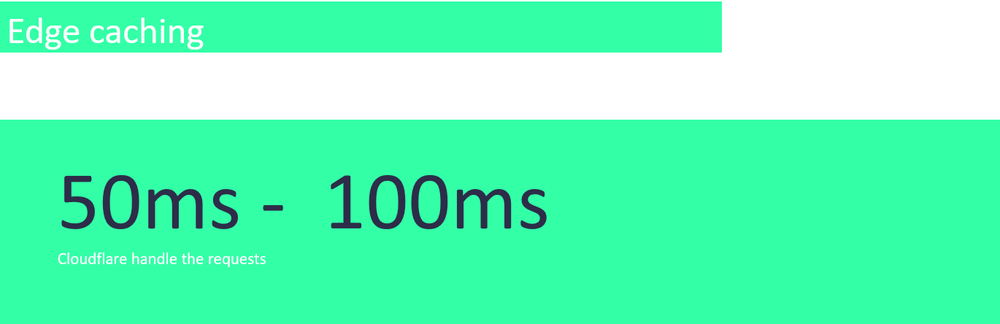
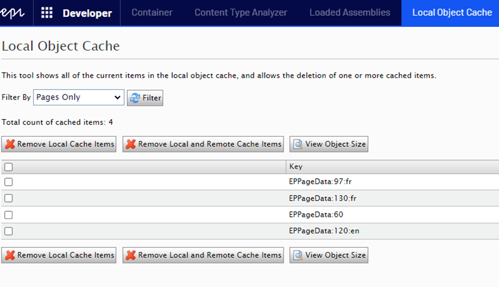
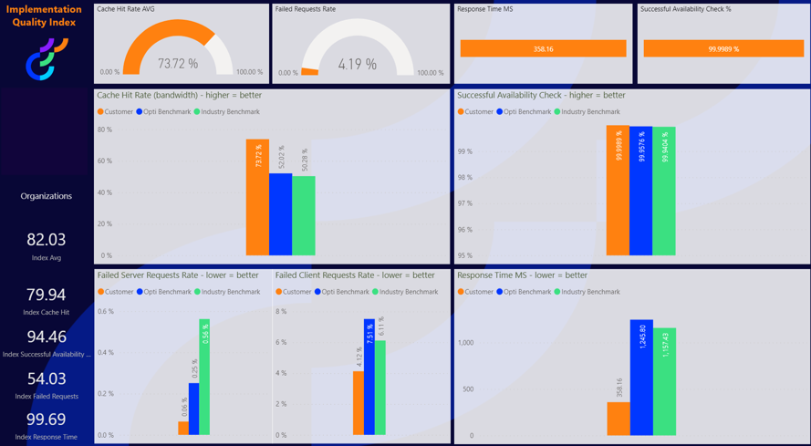

# Caching - Part - 3

This is the third article in a [series](https://eric.st-pierre.xyz/categories/caching/) about using what we can learn from the formula 1 engineers and apply it to our Optimizely implementation to improve our visitor experience. In this series, I will discuss some techniques to enhance our visitor experience by improving the delivery time of your content.

In the [last article](https://eric.st-pierre.xyz/posts/caching-strategy-part-2/), I discussed some memory cache techniques that can be applied to improve our site performance.   In this article, I will discuss how we can use edge caching and how we can measure the impact of the caching techniques we implemented and some pitfalls we must avoid.

## Starting the engine - Edge cache

To continue with our formula 1 analogy, we are now at a point where the engine and oil running through it are at the optimal temperature to get the best performance, and all the engine parts are lubricated.  It’s now time to start the engine and having it running full speed.

On our website, we got our data out of the database server and ready to be served from the server caches.  We can take this caching strategy one step further by integrating traditional caching methods and mechanisms into edge computing infrastructure. An Optimizely implementation running on DXP comes with a configured CDN in the form of Cloudflare. This CDN, or Content Delivery Network, caches content in delivery servers that are geographically located closer to the requesting users.  By moving memory storage closer to end users, edge caching reduces stress on extensive networks and improves content delivery.

When a user requests content from a website using a CDN, the CDN fetches that content from an origin server, and then saves a copy of the content for future requests. Cached content remains in the CDN cache as long as users continue to request it.

Edge caching gives us the best result when your pages have limited variation.  As it was discussed in the [previous article](https://eric.st-pierre.xyz/posts/caching-strategy-part-2/) for server output cache, if your site requires some personalization, you could use some front-end code that would apply the personalization.

By applying the edge caching technique, we now get first load times between 50ms and 100ms.  And the main benefice is that we don't have to hit the DXP app servers, which reduce the stress on our application.



## Maintaining the temperature and pressures of the engine

Now that we have applied our caching strategy, we need a way to monitor the strategy impact.

The first thing we can do is to install the [Developer Tools addon](https://nuget.optimizely.com/package?id=EPiServer.DeveloperTools).  This addons adds some developer-oriented functionalities to an Optimizely site.  The functionality that interests us the most in our context is the Local Object Cache.  This functionality shows all the current item in the local object cache.  It also allows us to delete some items if we run into cache issues.



Then there is a less known report provided by Optimizely that let us know some key metrics about the wellbeing of our site.

One tool that we have to measure the impact of the caching techniques that we apply to our site is the Implementation Quality Index provided by Optimizely.  This report gives us a series of metrics for our site, compared to Optimizely and Industry benchmarks.



The two stats of interest when measuring our site performance are the Cache Hit Rate and the Response Time MS.

Cache Hit Rate:

Served from Cloudflare without hitting the origin server combination of assets and edge html cache

Response Time MS:

Time it takes to perform a HTTP GET

By applying the techniques discussed in this series, we get a Cache Hit Rate of 73,72% and a Response Time MS of 358,16, which are both better than the Optimizely and Industry benchmark.

## Pitfalls

One of the most common problems we can run into with the strategy that was discuss in the articles of this series if cache clearing.  If we perform a clear all cache action, then all the caches (object, output) for all servers would be invalidated.  All the CDN cache would then be also invalidated and would require to be rebuilt.  So, we must avoid at all costs a full cache cleanup.  But at some point, we might need to clear some items from the cache.  For newly published item, as discussed in the [previous article](https://eric.st-pierre.xyz/posts/caching-strategy-part-2/), Optimizely takes care of the invalidation by implementing a synchronized cache.  For content editors, we discussed how to prevent cache for items they are editing.  Then what would be missing is the custom object cache and some items for which you would want to force a cache refresh.

One way to solve this it to implement some Master Key that would be assigned to specific content type, and then used to invalidate the cache.  One way to implement this strategy is implement a utility class that would create the key, use this key when adding content items of a certain type to the cache and assigning it an eviction policy, and add an event handler to invalidate the cache when an item of the specified ContentType is published.

Interface:

```cs
public interface IContentTypeCacheKeyCreator
{
    string GetTypeCacheMasterKey(Type type);
    string GetTypeCacheMasterKey(string typeName);
}
```

Implementation:

```cs
[ServiceConfiguration(typeof(IContentTypeCacheKeyCreator), Lifecycle = ServiceInstanceScope.Transient)]
public class ContentTypeCacheKeyCreator : IContentTypeCacheKeyCreator
{
    public string ContentTypeKeyPrefix { get; } = "EPContentType:";

    public string GetTypeCacheMasterKey(Type type)
    {
        return GetTypeCacheMasterKey(type.Name);
    }

    public string GetTypeCacheMasterKey(string typeName)
    {
        return $"{ContentTypeKeyPrefix}_{typeName}";
    }
}
```

Cache Service implementation with eviction policy

```cs
[ServiceConfiguration(typeof(ICacheService), Lifecycle = ServiceInstanceScope.Transient)]
public class CacheService : ICacheService
{
        /// <summary>
        /// Create CacheEvictionPolicy using a content reference as master key
        /// </summary>
        /// <param name="dependantContent"></param>
        /// <returns></returns>
        public CacheEvictionPolicy CreateEvictionPolicyByContentReference(ContentReference dependantContent)
        {
            string versionCacheKey = _contentCacheKeyCreator.CreateVersionCommonCacheKey(dependantContent);

            return new CacheEvictionPolicy(TimeSpan.FromSeconds(DefaultCacheDurationInSeconds), CacheTimeoutType.Sliding, null, new string[] { versionCacheKey });
        }

        /// <summary>
        /// Add an object to the cache based on a content reference
        /// </summary>
        /// <param name="key"></param>
        /// <param name="value"></param>
        /// <param name="dependantContent"></param>
        public void Add(string key, object value, ContentReference dependantContent)
        {
            _cache.Insert(key, value, CreateEvictionPolicyByContentReference(dependantContent));
        }
}
```

PublishedContent event handler:

```cs
[InitializableModule]
public class CacheInvalidationOnPublishEvents : IInitializableModule
{
    private Injected<ISynchronizedObjectInstanceCache> _cache;
    private Injected<IContentCacheKeyCreator> _contentCacheKeyCreator;
    private Injected<IContentTypeCacheKeyCreator> _contentTypeCacheKeyCreator;
    private Injected<IClient> _client;
    private Injected<IContentRepository> _contentRepository;
    private Injected<IRelationRepository> _relationRepository;

    public void Initialize(InitializationEngine context)
    {
        // Subscribe to publishing events
        var contentEvents = ServiceLocator.Current.GetInstance<IContentEvents>();
        contentEvents.PublishedContent += ContentEventsOnPublishedContent;
    }

    private void ContentEventsOnPublishedContent(object sender, ContentEventArgs contentEventArgs)
    {
        IContent content = contentEventArgs.Content;

        //Remove from cache to force dependancies of master keys to be also removed
        string key = _contentCacheKeyCreator.Service.CreateVersionCommonCacheKey(content.ContentLink);
        _cache.Service.Remove(key);

        //also check for cache by type
        string typeName = content.GetType().Name.Replace("Proxy", "");
        string keyType = _contentTypeCacheKeyCreator.Service.GetTypeCacheMasterKey(typeName);
        _cache.Service.Remove(keyType);
    }
}
```

# CONCLUSION

So, with all those techniques (object and output caching, edge caching, reports), we are now equipped to deliver a better user experience by minimizing the first load of a page, and at the same time, reducing the stress on our hosting environment.

