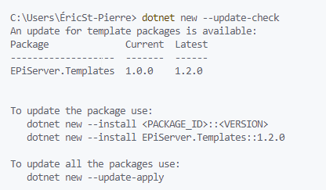
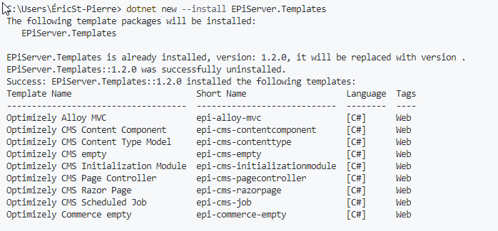
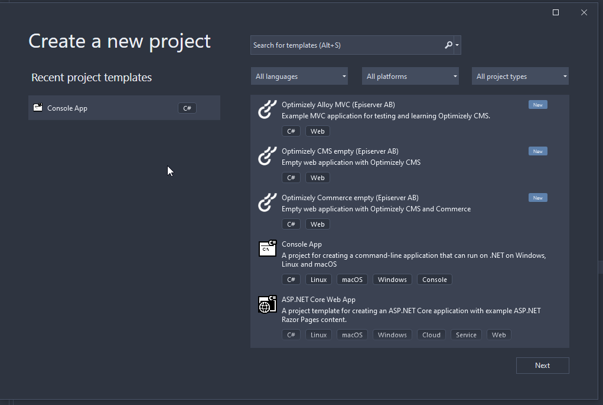
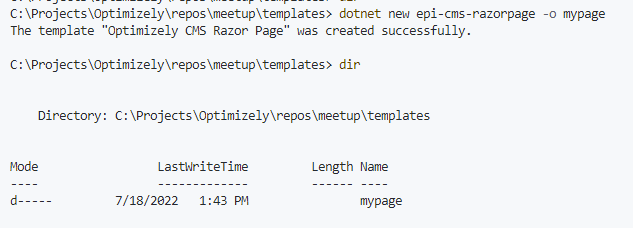
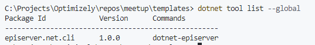

This is the second article in a 3-part series on how to create an Optimizely based site running on the .NET5 framework. In the [previous article](https://eric.st-pierre.xyz/posts/move-net5-dotnet-cli-basis/) of this series, I went into creating a new .NET5 application with the out of the box dotnet CLI templates.  In this article, I will cover what needs to be done to get access to some Optimizely oriented scaffolding templates.

On a new .NET5 installation, only the standard .NET projects templates will be available when creating a new site. So, how do you install the scaffolding template that will help you start a new Optimizely site?  

### Optimizely scaffolding templates

New dotnet CLI scaffolding templates can be added to the template list by installing some NuGet packages. The Optimizely scaffolding templates are available from the EPiServer.Templates NuGet package ([https://www.nuget.org/packages/EPiServer.Templates/](https://www.nuget.org/packages/EPiServer.Templates/)).  

You can install the package with the following dotnet CLI command.

```bash
dotnet new --install EPiServer.Templates
```

Developer might be improving those templates.  So, you might want to check if there is an updated version of the templates package with the following command.

```bash
dotnet new --update-check
```



To update the package version, you need to run the following command.

```bash
dotnet new --update-apply
```

At the time if this writing, here are the Optimizely project and components templates that would be installed.



We now have the scaffolding templates to create a new empty CMS site (Optimizely CMS empty) or a Commerce site (Optimizely Commerce empty), or we can spin an Alloy example site (Optimizely Alloy MVC).

Adding the templates will make them available to the dotnet new CLI command and it will also make them available to the IDE you use (Visual Studio, Rider) if you prefer to create your projects from an IDE.



The EPiServer.Templates NuGet packages will also install templates to scaffold some code components.  With the dotnet new command you could create some Content Components, Page Controller or Razor Pages.

You could create a Razor page using the following command

```bash
dotnet new epi-cms-razorpage -o mypage
```



The following view and model files will be created to implement your page.

mypage.cshtml

```html
@page
@model MyAppNamespace.mypageModel
@using EPiServer.Web.Mvc.Html

@{

}

@{/*
<div>

    @Html.PropertyFor(m => m.CurrentContent.MainBody)

</div>
*/}
```

mypage.cshtml.cs

```csharp
using EPiServer.Web.Mvc;

namespace MyAppNamespace
{
    public class mypageModel : RazorPageModel<PageData>
    {
        public void OnGet()
        {

        }
    }
}
```

### Optimizely CLI Tool

Another tool that can be added is the Optimizely Command-line interface (CLI).  This tool helps with creating a new project by allowing us to create the databases and admin user.

You can install the Optimizely CLI tool using the following command.

```bash
dotnet tool install EPiServer.Net.Cli --global --add-source https://nuget.optimizely.com/feed/packages.svc
```

You can confirm that the tool is successfully installed by running the list dotnet CLI command.  This will give you information about the installed tools.

```bash
dotnet tool list --global
```



To get the list of available options for the Optimizely CLI, you can run the following command.

```bash
dotnet-episerver --help
```

The following commands can be executed on your project.

```bash
Commands:
  create-cms-database <project>
  create-commerce-database <project>
  update-database <project>
  add-admin-user <project>
```

With all those tools and packages installed, we now have everything we need to create a new Optimizely project, which will be part of the next article of the series.

### References

https://docs.developers.optimizely.com/content-cloud/v12.0.0-content-cloud/docs/installing-optimizely-net-5

Check Optimizely article on Templates

https://world.optimizely.com/blogs/Johan-Pettersson/Dates/2022/3/new-templates-and-getting-started-experience/