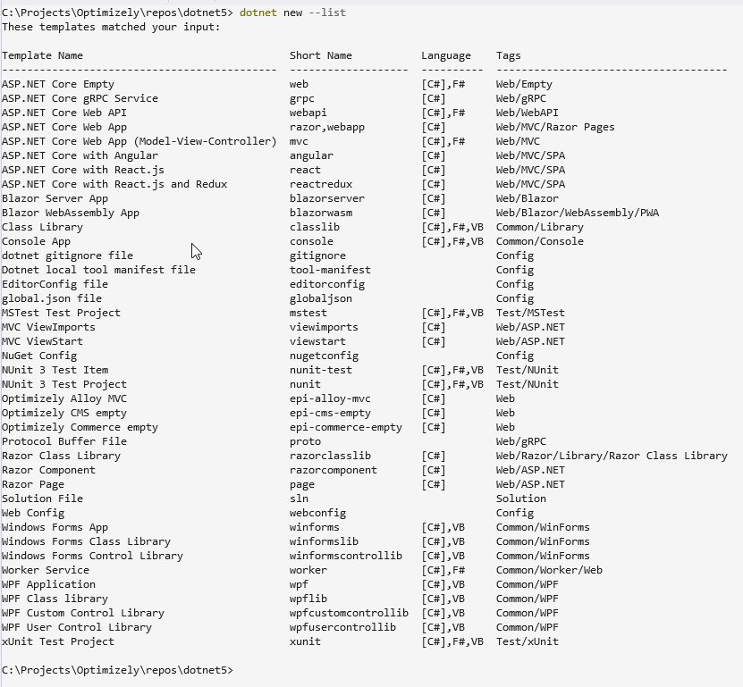
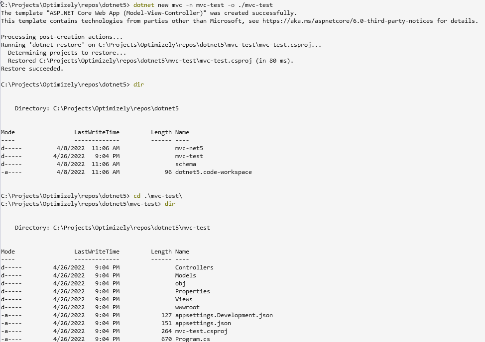

This is the first article in a 3-part series on how to create an Optimizely based on the .NET5 framework.  In this first article, I will cover the basics of the donet cli tools.  In the second article, I will cover the templates that are available to create Optimizely sites.  In the third article, I will cover how to create Optimizely sites, and how to configure them.

In a [previous article](https://eric.st-pierre.xyz/posts/move-net5-reference-sites/), I discussed the different options to start a site from one of the examples or reference Optimizely sites.  But how to you proceed if you want to start a new Optimizely project from scratch? 

.NET5 comes with a cross-platform command-line interface (CLI) that is a toolchain to create, develop, build, execute and publish .NET applications.

.NET as always allowed us to install multiple SDKs and runtimes in parallel on the same workstation or server.  The dotnet cli allows us to target the .NET framework we want to use. How do we know which one are installed?

The dotnet cli as a command to list the available SDKs, which is `dotnet --list-sdks`

```console
C:\Projects\Optimizely\repos\dotnet5> dotnet --list-sdks
3.1.417 [C:\Program Files\dotnet\sdk]
5.0.102 [C:\Program Files\dotnet\sdk]
5.0.104 [C:\Program Files\dotnet\sdk]
5.0.302 [C:\Program Files\dotnet\sdk]
5.0.303 [C:\Program Files\dotnet\sdk]
6.0.201 [C:\Program Files\dotnet\sdk]
```

When creating an application, we can specify which version to use with the -f net5.0 command line option to specify the framework.  

So, how do we use the dotnet cli to generate a new website?  To create any kind of .NET5 application, you need to execute the `dotnet new` command in the terminal of your choice.  When executing the `dotnet new` command, we need to provide it with the type of application we want to create so that it can scaffold our starting code structure.  To see which project templates are available, you need to run the `dotnet new --list` command to get the list.



Now that we know which templates we can use to create our apps, let's create an ASP.NET Core MVC app.

To do so we would call the following command

```console
dotnet new mvc -n hellomvc -o hellomvc
```

This will create a new MVC website, with the name (-n) hellomvc in the hellomvc output folder (-o).



Now that we have a new apps, how to we execute the app.

First, we need to check the available runtimes.  This can be achieved with the --list-runtimes command.

```console
dotnet --list-runtimes
```

The list should have the default Microsoft.NETCore.App to run a console application, Microsoft.AspNetCore.App to run web applications and Microsoft.WindowsDesktop.App to run desktop applications.

To run our site, we would then execute the `dotnet run` command

When running the site locally, we have two options to run a web application.  We can either choose to run the web application on IIS (or IIS Express) or we can choose to run it with Kestrel.

`dotnet run` will use the embedded Kestrel server by default. IIS Express will use IIS Express as a reverse proxy which calls Kestrel behind the scenes.

Kestrel is a cross-platform [web server for ASP.NET Core](https://docs.microsoft.com/en-us/aspnet/core/fundamentals/servers/?view=aspnetcore-6.0). Kestrel is the web server that is included and enabled by default in ASP.NET Core project templates.

Now we have the tools to create new ASP.NET Core web apps.  In the next article,  I will go over the available project templates to create new Optimizely sites.