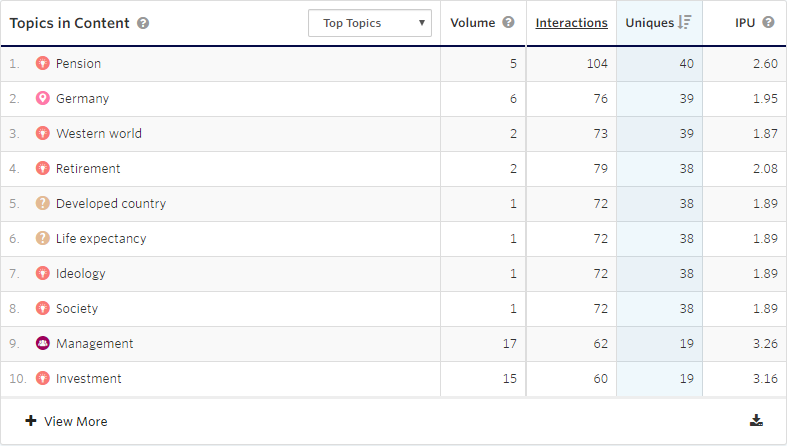

In the [previous article](https://eric.st-pierre.xyz/posts/personalization-content-recommendation/), I covered the basics of applying one-on-one content personalization by using Optimizely Content Recommendation. Now let’s discuss how to integrate Content Recommendation and the implementation details of some of the configuration options.

When implementing a content recommendation strategy using the Optimizely Content Recommendation product, the first thing to do is to add a script to our page that will ingest the site content for analysis and will deliver recommended content to the visitors. We could start right away by adding the packages and script needed to integrate Content Recommendation to our solution, but there is one steps that should be taken prior, to prevent having to re-process the ingestion of all our site content. Out of the box, the ingestion script will look for specific fields to get the title and content and some metadata about our pages.

By default, the following fields will be scraped if they are available on a page:

`og:title` for title  
`og:description` for description  
`og:image` for image  
`article:published_date` for published date  
`article:category` for categories

Since the ingestion is done the first time a page is visited, we need to configured other metadata that we would like to be consider for our recommendations prior to the launch of our Content Recommendation implementation. This would be a good time to think of the content that will help the algorithms identify the content of your site. If your sites use some taxonomy that would be helpful in delivering relevant content to your visitor, then those taxonomy terms should be added to the indexation of your content. If you have other metadata that would be relevant to set the context on your content, they could also be added to the indexing configuration.

Content analysis can be configured by adding our own custom attributes to the content ingestion. Those attributes would be `<meta>` tags with a name in the form of `idio:custom_variable`.

```xml
<meta property=“idio:custom_variable” content=“value”>
```

Those tags could be added at a later stage or updated, but the ingested content would then need to be reindexed.

Once the metadata configuration is completed, we need to add the Content Recommendation Nuget package to our solution. The Nuget package to install is `EPiServer.Personalizarion.Content.UI`. This package will include the scripts required to index the content and track the visitor behaviour on the site, the dashboards and delivery administration screens and an Optimizely delivery block.

By adding this package to your solution, the script would be included to your page rendering if your site uses [RenderRequiredClientResources](https://world.optimizely.com/documentation/developer-guides/CMS/client-resources/#RenderingClientResources) in the HTML head element. This script could also be included in your site by using a tag management solution, such as Google Tag Manager if you prefer. In the case of an integration with Google Tag Manager, it would result in double tracking. To prevent this, you should set the `episerver:personalization.content.DisableDefaultTracking` configuration key to `true` in your site configuration file.

## User Tracking

An anonymous user profile is created when a visitor accesses the site for the first time. This profile allows us to aggregate the data tracked for a specific user. We can see which pages of the site the user visited, and with which type of content the visitor interacted with.


One thing to note, at the time of this writing, is that this user profile is different from the Optimizely Visitor Intelligence profile. But there is a plan to aggregate all those tracking information into one unified profile in the Optimizely Data Platform.

## Content Ingestion

Content ingestion is an organic process, it’s not something that is done with scheduled jobs or a one-time job. Pages are ingested when visitor access the page for the first time. Ingested content are unique pages, based on their URL. This indexation process will create a content profile that will gather information about the page. Title, image, description and any custom metadata configured, content are store for the page in its profile. During the ingestion process, the content is scanned for topics and a topic cloud related to the content of the page is created.

## Sections and Flows

One part of the ingestion process is to assign Section to the content, using flows. Section are tags that are added to our content. They are used to configure the which content is used for delivery. Sections are added to content base on rules that are defined in Flows. Flows allow us to define some rules that a content item must match to be assigned to a Section.


## Dashboards

Within the package of Optimizely Content Recommendation, we get a series of dashboards that present us some metrics about the site content and the user interaction with it.

The **Insight Dashboard** shows us how topics perform based on the interactions (views on page), the unique IP addresses that visited the site and the interactions per unique visitors.


The **Topics in Content** shows the number of interactions with content in which a topic appears. This can help you measure if your content and topics are consumed as you expect them to.



The **Topic Performance** graph shows the volume of content profiles versus the unique visit.


The **Content Utilization** view shows a graphical representation of topic performance.


The **Goals** dashboard shows conversions. Goals are interactions that you want your visitor to perform. Example of goals could be to fill a form, download a document, view a specific number of pages in a section. Goals tracking can help you see if you content is engaging people.


Goals tracking can be done by adding the following Javascript directly to your site or by integrating it through Google Tag Manager.

```jsx
<script>
  _iaq.push(['goal', 'Subscribed to Newsletter']); _iaq.push(['track',
  'convert']);
</script>
```

An example of a Google Tag Manager can be seen at the following link.

[Creating goals and tracking conversions - Optimizely Developer Community](https://world.optimizely.com/documentation/developer-guides/personalization/content-recommendations/creating-goals-and-tracking-conversions/)

The **Engage Dashboard** shows the deliveries performance. Deliveries are used when we want to render content to a visitor based on previous interactions and its interests based on analytics.


In this article, I covered the integration of the Content Recommendation packages, how user and content are tracked, and the dashboards provided with the product. In the next article, I will also cover the different ways to deliver the content in an Optimizely solution or on any other site that is including the Content Recommendation script.
