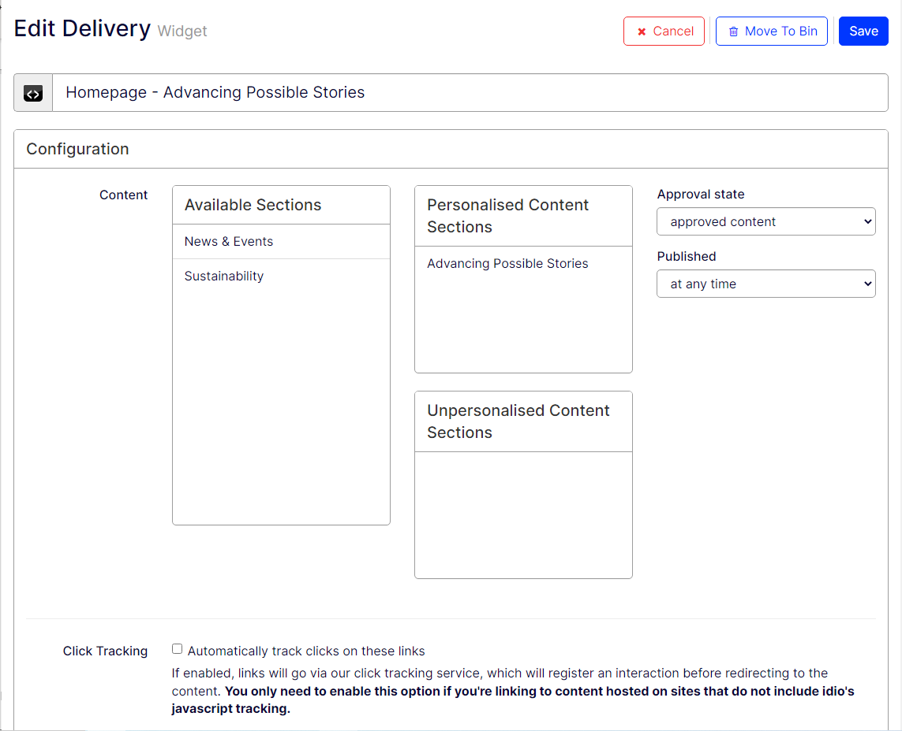
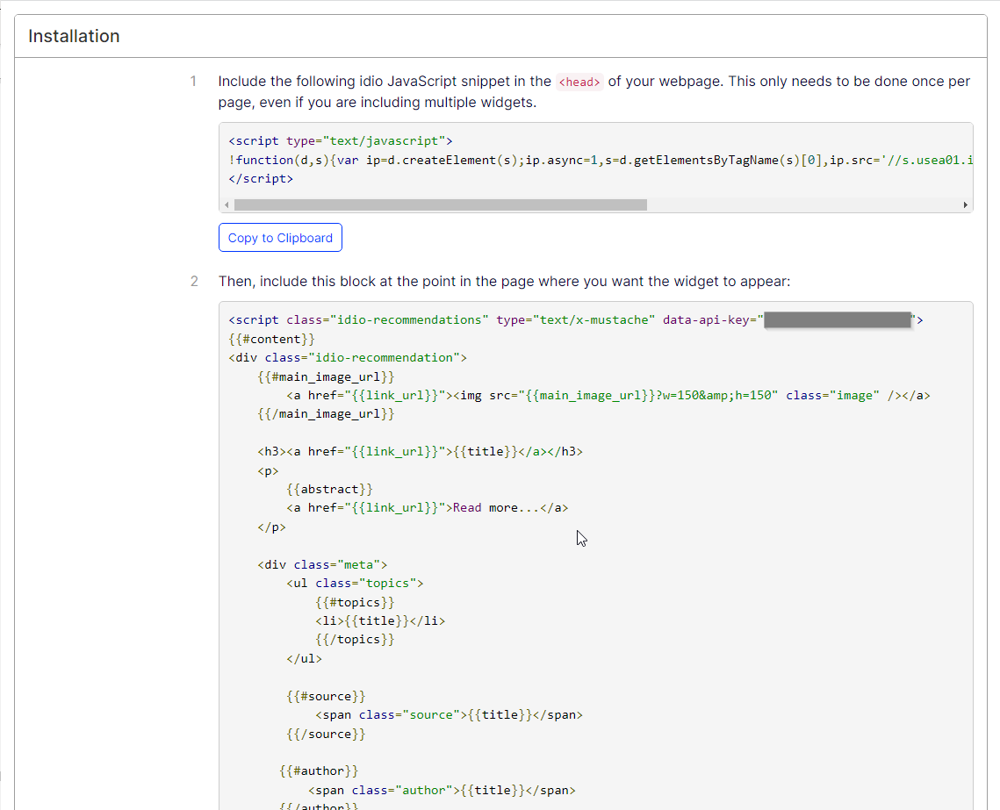
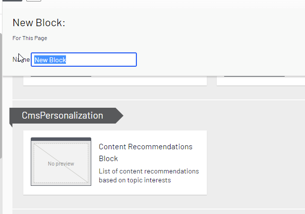
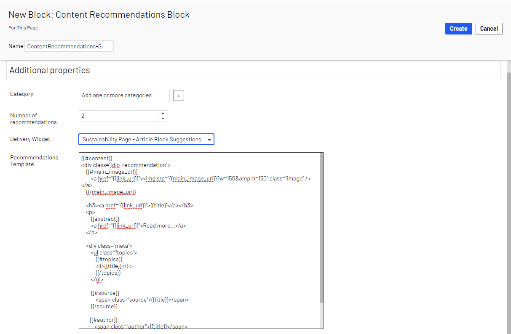

This is part 2 on the implementation of Optimizely Content Recommendation product. In the [first part](https://eric.st-pierre.xyz/posts/personalization-content-recommendation-implementation-part-1/), I discussed about the integration of the Content Recommendation package and the administration, configuration and dashboards it brings to our solution implementation. In this article, I’ll discuss how the Content Recommendation package can be used to deliver personalized content to our site visitors.

## Let’s deliver some content
To deliver personalized content to our visitor, we must create and configure a delivery in the Content Recommendation administration screen. Creating a delivery is the process of selecting some content we want to deliver to our client and implementing the template that will render the content to out visitor. Content is selected by assigning one or more sections to the delivery.  As we saw in the [previous article](https://eric.st-pierre.xyz/posts/personalization-content-recommendation-implementation-part-1/), a section is a tag that is assign to some piece of indexed content bases on a series of criteria, known as flows. When a content editor creates a new page in which he wants to include a personalized content delivery, the id assigned to the delivery when created, will be used to include this delivery into our page. The id used in the page will tell the Content Recommendation Service into which delivery it can fetch and choose its content from. 



When creating a delivery, we are offered with some installation instructions and code snippets that we can add into our site.



If the Content Recommendation script was not integrated as part of the package installation, the first block of code is the script required to include the Content Recommendation script in your page.

```html
<script type="text/javascript">
!function(d,s){var ip=d.createElement(s);ip.async=1,s=d.getElementsByTagName(s)[0],ip.src=‘//s.usea01.idio.episerver.net/ip.js',s.parentNode.insertBefore(ip,s)}(document,’script’);
</script>
```


The second block of script is the code you would include in your page if you were not using the Recommendation Block.  This script sets up the attributes required to connect to the Content Recommendation service to get the personalized content.  On the `<script>` tag, the `data-api-key` is the ID of the delivery, that is used by the service to get the right content for the visitor.  This is the pool of data in which the service will fetch personalized content for the visitor. The script included in the  `{{#content}} {{/content}}` is the Mustache template that will render the markup that will be served to the visitor.  This template is repeated for each recommendation item that is returned to the visitor. 
```html
<script class="idio-recommendations" type="text/x-mustache" data-api-key="[DATA-API-KEY]">
{{#content}}
<div class="idio-recommendation">
    {{#main_image_url}}
        <a href="{{link_url}}"></a>
    {{/main_image_url}}

    <h3><a href="{{link_url}}">{{title}}</a></h3>
    <p>
        {{abstract}}
        <a href="{{link_url}}">Read more...</a>
    </p>

    <div class="meta">
        <ul class="topics">
            {{#topics}}
            <li>{{title}}</li>
            {{/topics}}
        </ul>

        {{#source}}
            <span class="source">{{title}}</span>
        {{/source}}

       {{#author}}
           <span class="author">{{title}}</span>
       {{/author}}
   </div>
</div>
{{/content}}
</script>
```

If you use the Content Recommendation block that comes out-of-the-box with the package installation, you won’t need to take the `<script>` tags, only the `{{#content}}` and what is inside will be required by the recommendation block.

## Mustache Template
The Content Recommendation block rendering is using the Mustache templating engine. Mustache is a logic-less templating engine that replace tags with provided values. In the case of a Content Recommendation block, a collection of value is returned by the service. Since the template is HTML, this allows us to style the recommended content to match the look and feel of our site.

Following is an example of a Mustache template that will render a list of articles, with the Title, link and an image for the article.  Since all the articles did not have an image, a condition is added to return a default image so have a consistent layout.

```html
<script class="idio-recommendations" type="text/x-mustache" data-api-key="[DATA-API-KEY]">
<h3>Recommended for you</h3>
<div class="grid  grid--middle">
    <div class="grid__item">
        <div class="grid">
        {{#content}}
            
            <div class="idio-recommendation grid__item one-quarter palm--one-whole">
                <div class="">
                    <figure class="figure figure--caption-under  push--bottom">
                        <div class="grid">
                            <div class="grid__item palm--one-third">
                                <a href="{{link_url}}" class="figure__media-link">
                                    {{#main_image_url}}
                                        
                                    {{/main_image_url}}
                                    {{^main_image_url}}
                                        
                                    {{/main_image_url}}
                                </a>
                            </div>

                            <div class="grid__item palm--two-thirds">
                                <figcaption class="figure__caption js-equal-height-item no-border" style="height: 73px;">
                                    <a href="{{link_url}}" class="figure__caption__label">{{title}}</a>
                                </figcaption>
                            </div>
                        </div>
                    </figure>
                </div>
            </div>
            
        {{/content}}
        </div>
    </div>
</div>
</script>
```


When using the Mustache template, we are offered some variables that can be used when rendering the content.
* title: Title of the content item.
* link_url: Link to the content item, see the *Linking* section above.
* main_image_url: URL to the main image of the content.
* abstract: Summary of the content item, maximum 50 words long.
* topics: Refers to a **list of topics** mentioned in the content.
* source: The source RSS feed of the content item.
* author: Author of the content item.


## Ways to implement the recommendation block
There are mainly 3 ways to implement the recommendation block:
* Use the OOTB Content Recommendation block
* Override the Content Recommendation block
* Create a block from scratch

A first option is to use the Content Recommendation block that was added to the solution with the installation of the Content Recommendation NuGet package. This block can be added to a page, and it allows a content editor to choose a delivery and apply some configurations. The out of the box block offers configuration for the delivery to use, the number of results and the Mustache template that can be updated by the content editor.





A second option that can be used is to inherit the recommendation block.  This option is a good way to facilitate the recommendation block use for content editors who don’t understand the mustache template.  On this implementation, we could hardcode the rendering template of offer a selection of prepared mustache templates.  If the template is pre-configured, we could hide them from the content editor to prevent some editor to mess with the actual template markup.  Another option could also be to bind a delivery using its ID and add some option to customize the mustache template rendering.

The last option, which involves the most implementation work, would be to call directly the Content Recommendation Service API in a block controller to get the results and return the rendered content using a Razor view.  This would allow for more control on the rendered result, but also it would remove some of the flexibility of a markup template.

## Use recommendation outside of Optimizely
The last option that was discussed opens a door to use Optimizely Content Recommendation outside of an Optimizely implementation. Since content recommendation is a service on its own, it could be used outside of an Optimizely site.  Adding the script to another site would allow us to both ingest content and deliver content to another site with the code provided on the delivery administration screen.  So, if your main site as a sister site which has some news that you would like to deliver to your visitor based on their behavior on your site, you could add the script to ingest content on the sister site, and this content would be available to section of content.  You would know the content is coming from another site since its source attribute would be different.  You could also add the code provided for delivery to the sister site to deliver personalized content.

So, in this article I discussed the implementation techniques of a personalized content delivery.  Those techniques covered using the out-of-the-box recommendation block, inheriting the block to offer a more controlled experience to the content editor and creating a fully custom block.   I also covered how to integrate content with another site.  In the next article, I will present some advanced personalization strategies, and ways to use the analytics data gathered by Content Recommendation to other Optimizely functionalities.

