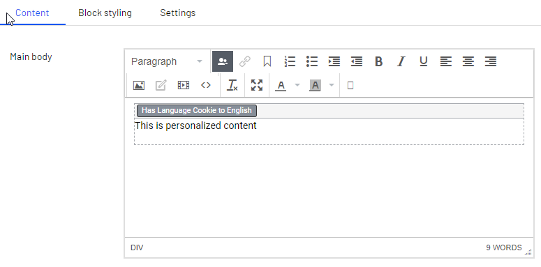
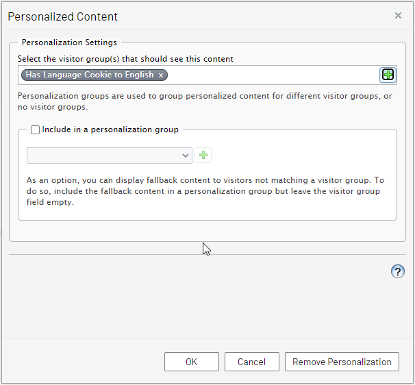
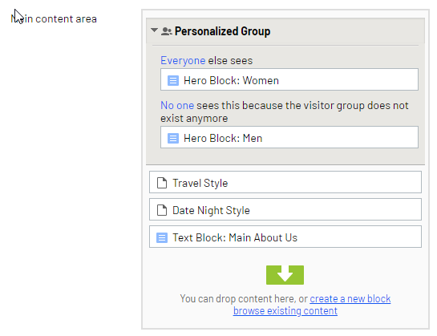
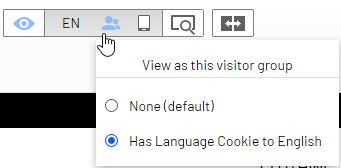
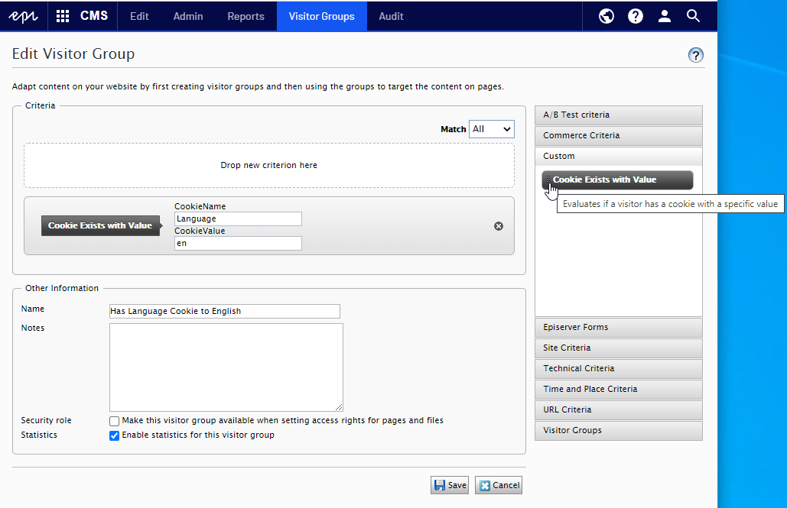

This is the third article in a series about personalization. During this series, I will cover the different sides of personalization, from more general definitions of personalization to Optimizely cloud-based products offering and how to implement them. The [first article](https://eric.st-pierre.xyz/posts/personalization-introduction/) was about building the foundation to help customers move along their personalization journey. In the [second article](https://eric.st-pierre.xyz/posts/personalization-segmentation/), I explained what segmentation is and how it is translated in an Optimizely implementation through visitor groups. In this article, I will cover how to achieve personalization by implementing and using visitor groups.

## Visitor Groups implementation

You might be developing a personalization strategy with a client, and you have defined some visitor characteristics on which we want to personalize some piece of content. Those user’s information will allow you to split users into groups or segments. So now that we have identify some visitor segmentations, how can we use them to personalize the user experience? Visitor groups can be used to conditionally render content on a page based on those segments.

Personalization using visitor group can be seen as a rule-base kind of personalization. You implement personalization by creating visitor groups based on criteria and apply those groups to target content for the segment. Visitor groups are using data from visitors incoming HTTP request to match against the criterion.

## How to use visitor groups to personalize content

Visitor groups can be used to personalize many parts of the content, from content area, blocks and rich-text to products discounts and marketing campaigns.

To apply a visitor group to a piece of content, you need to open it in edition mode. Then, from the editor toolbar, you can choose the Personalized Content option.

You will then be prompted to choose one or more visitor groups to apply to the selected content.

You can also apply visitor groups to content area by using the Personalize option from the context menu.

To preview the impact of the visitor groups on the visitor experience, you can use the Preview option and choose for which visitor group you want to preview the experience.

For more details, you can visit the Optimizely Visitor Groups user guide
https://webhelp.optimizely.com/latest/en/personalization/visitor-groups.htm

## Custom visitor group criteria implementation

If the provided set of visitor groups doesn't fulfill your customer needs, you can implement your own visitor group criteria. Let’s say you want to personalize some content based on a value stored in a cookie. We will take this example to go through the steps to implement a custom visitor group. Let’s implement a visitor group that evaluates if a visitor has a specific cookie and value.

To develop custom visitor group criterion, you need to implement at least two classes which are a model class and a criterion class. The model class will be used to store and persist the configuration of the visitor group entered by an editor in the visitor group editing interface. The criterion class is used to evaluate the visitor context against the visitor group configuration data and check if the criteria are fulfilled.

**The model class**

The model class instances are persisted to the Dynamic Data Store, and they must implement the `ICriterionModel`. You can inherit from the `CriterionModelBase` class, which implement the `ICriterionModel` interface with standard behaviors. There is one method that needs to be overridden, which is `Copy()`. If the model has only simple value properties, then you can call the `base.ShallowCopy()` which will create a copy of the model. If your model has some reference type properties, then you must add logic to copy those properties.

To this model, you need to add public properties that will represent the criterion settings in the administration interface. Input fields will be created using suitable editing element. If you want to control parts of the rendering of the property, you can add the `CriterionPropertyEditor` attribute. `PreText` and `AfterText` can be used to add text before and after the element. If your Optimizely administrative interface is translated, you can add a translation for the labels with a xml localization file. You can also use the `CriterionPropertyEditor` attribute to set the input to be a dropdown list with predefined options. To do so, you would assign an implementation of the `ISelectionFactory` interface to the `SelectionFactoryType` attribute. If the options you want to use can be represent as an `Enum` in a dropdown list, you can use the `EnumSelectionFactory` included in the Content Cloud implementation. Visit the [Using the CriterionPropertyEditor property attribute](https://world.optimizely.com/documentation/developer-guides/CMS/personalization/developing-custom-visitor-group-criteria/#CriterionPropertyEditor) for more details on other attributes you can set for a property.

Validations rules can be assigned for required fields, range of values, length of a string or a matching regular expression by applying validation attributes to the properties. Custom server-side validation can also be applied by implementing the `IValidateCriterionModel` interface on your model.

Here is an example of the implementation of the model class for our cookie with value example.



**The criterion class**

After we have the implementation of the model class, we must implement the criterion class to evaluate if the visitor context and the criterion data stored in the model match or not. To implement the criterion class, we must inherit from the `CriterionBase` class, passing it our implementation of the `ICriterionModel`. We then must override the `IsMatch()`method which is called to evaluate if a visitor is part of a visitor group. The last part is to decorate the criterion class with the `VisitorGroupCriterion` attribute to identify the class as a criterion. `Category` identify the group in which the criterion will be found. `DisplayName` and `Description` are used for the name and tooltip description.

If you have some requirements, you can override the event handling done for the following events, `StartRequest`, `EndRequest`, `StartSession` or `VisitedPage`. You can override the event handling by overriding the Subscribe and Unsubscribe methods to provide you specific handlers.

Following is the example of the criterion class for our example.



This would be the experience of an editor configuring an instance of our custom visitor group.

This implementation of a custom visitor group would be configured and used by an editor to personalize content as any other pre-package visitor groups.

In this article, I covered the steps to use a visitor group to personalize content and how to implement your own custom visitor groups. In the next article of the series, we will discuss another personalization step, which is content recommendation.

## Reference

https://world.optimizely.com/documentation/developer-guides/CMS/personalization/developing-custom-visitor-group-criteria/
