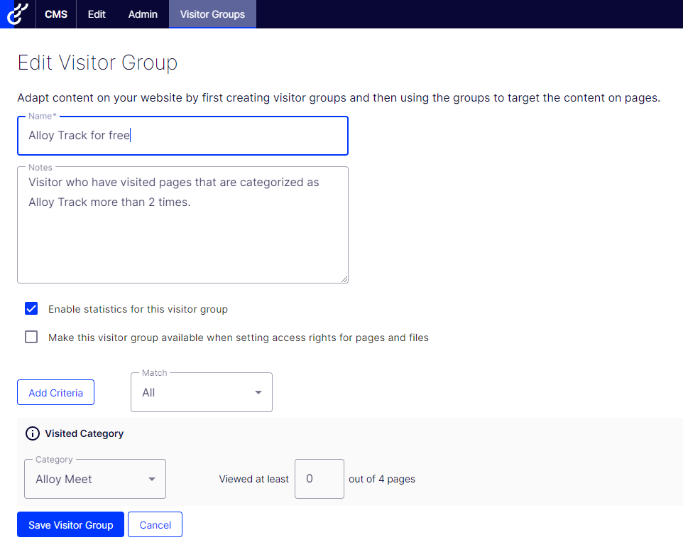

This is the second article in a series about personalization. During this series, I will cover the different sides of personalization, from more general definitions of personalization to Optimizely cloud-based personalization products offering and how to implement them. The [first article](https://eric.st-pierre.xyz/posts/personalization-introduction/) was about building the foundation to help customers move along the personalization path. In this article, I will cover one of the first level of personalization we can achieve with segmentation.

## A little bit of history

Segmentation is not something new in the marketing world. Segmentation can be seen as the foundation of modern marketing, and with over 140 years of history it comes with a lot of tools, approaches and techniques with it.

Based on [Wikipedia](https://en.wikipedia.org/wiki/Market_segmentation#History), the business historian, Richard S. Tedlow, identifies four stages in the evolution of market segmentation:

- **Fragmentation (pre-1880s)**: The economy was characterised by small regional suppliers who sold goods on a **local or regional basis**
- **Unification or mass marketing (1880s–1920s)**: As transportation systems improved, the economy became unified. Standardised, branded goods were distributed at a national level. Manufacturers tended to insist on strict **standardisation** in order to achieve scale economies to penetrate markets in the early stages of a product's lifecycle. e.g. the Model T Ford
- **Segmentation (1920s–1980s)**: As market size increased, manufacturers were able to produce different models pitched at different quality points **to meet the needs of various demographic and psychographic market segments**. This is the **era of market differentiation based on demographic, socio-economic, and lifestyle factors**.
- **Hyper-segmentation (post-1980s)**: a shift towards the definition of **ever more narrow market segments**. Technological advancements, especially in the area of digital communications, allow marketers **to communicate with individual consumers or very small groups**.

As we can see, segmentation started as something with very few inputs, mainly where the customers lived and with the increased amount of available data about customers, it evolved into a form of one-to-one marketing. A parallel can be done between marketing segmentation and the level of maturity of a customer on the personalization journey, from delivering content on a demographic base to a one-to-one user experience.

So, to continue our discussion about content personalization using segments, let's take the following definition as a starting point:

> In marketing, market segmentation is the process of dividing a broad consumer or business market, normally consisting of existing and potential customers, into sub-groups of consumers (known as segments) based on some type of shared characteristics.
> [Wikipedia](https://en.wikipedia.org/wiki/Market_segmentation)

So, the idea of segmentation is to create groups of visitors and deliver them content based on the characteristics we assigned to this group.

An example of a grouping that we could create would be existing and new visitors. If we can identity if a visitor is somebody that already visited our site, we could on the homepage of the site, greet them with a different message than somebody who is visiting the site for the first time.

Another grouping that we could create would be based on: "Do you have the password to access that gated content?". Allan Thraen provided a good solution on how to achieve this segmentation in his article [Editor Hack: Add simple password protection to some content (code free)](https://www.codeart.dk/blog/2021/9/editor-hack-add-simple-password-protection-to-some-content-code-free/). If a visitor meets the condition of entering the password, which match a specific group of visitors, then we provide him with a piece of content. So, a group of visitors is granted access to a piece of content that is relevant to them.

A last example could be to promote products based on the location of a visitor. So, in this case, the visitor groups would be match against the visitor location. We could also add an API call to a weather service based on the visitor location and use those two information's to promote discounts based on the location's weather. So here in Canada, we are nearing the snow season. If I have your location and weather forecast, I can promote you discounts on shovels or snowblower so that you are ready for the next big storm.

## Optimizely implementation

So, how can we apply those segmentation ideas in an Optimizely implementation? How can we use different grouping to help provide content that is more relevant to visitors?

In Optimizely, an implementation of a visitor segment can be done by applying a visitor group. Visitor groups are part of a base Optimizely solution. Out-of-the-box, we are provided with an administration dashboard and some ways to use the visitor groups to delivered personalized content.

The administration interface allows us to create and configure some instance of visitor groups by selecting one or more criteria. The [Optimizely user guide documentation](https://webhelp.optimizely.com/latest/en/cms-admin/visitor-groups.htm) offers information on managing user groups (creating, duplicating, deleting) and examples on how to configure visitor groups (geographic location and coordinates, referrer, …). Once a visitor group is used for some content delivery on the site, we can then check to see if the user visiting the site match the criteria of the visitor group.

## Visitor Groups

So, what is a Visitor Group? A visitor group can be described as

> Site visitors with something in common, such as age, geographic location, and so on.

So, what can we use to characterize a visitor? A visitor can be characterized by if geographic location and coordinates (based on Ip address), by information from where the user came from to the site (landing URL, referrer) or by action the use has taken on the site (number of visits, visited pages or categories).

A base Optimizely implementation comes with a series of built-in visitor groups criteria using those characteristics to help us identify visitors.

Optimizely Visitor Groups criteria:

- Site Criteria
  - Number of Visits
    - Matches the number of times the visitor has visited the website.
  - User Profile
    - Matches a value stored in a user’s profile.
  - Visited Category
    - The visitor must have visited the specified number of pages to which the category is applied.
  - Visited Page
    - The visitor must have visited that page during the current session.
- Time and Place Criteria
  - Geographic Coordinate
    - Uses the visitor’s approximate location in a geolocation database (based on visitor IP address).
  - Geographic Location
    - Matches the visitor to a specific continent, country, and region.
  - Time of Day
    - Matches the visitor's time period with the start time, end time, and days you specify.
- URL Criteria
  - Landing URL
    - Matches the URL with which the visitor enters the site.
  - Referrer
    - Matches the Host name or URL of the referred page that was clicked before entering the site, such as a search engine result page.
  - Search Keyword
    - Stores the URL of the referred page that was clicked before entering the site, such as the URL of a search engine result page.
- Visitor Groups
  - Visitor Group Membership
    - Select members from existing visitor groups.

If the out-of-the-box is not enough, some packages can be added to expand the list of visitor groups. Some examples of those package are:

- [Episerver Visitor Group Criteria Pack](https://nuget.optimizely.com/package/?id=EPiServer.VisitorGroupsCriteriaPack)
  - Display channels
  - OS
  - Browsers
- [Episerver Forms Samples package](https://github.com/episerver/EPiServer.Forms.Samples)
  - Episerver Forms
    - Submitted Form
    - Submitted Form Value
- Episerver Commerce Criteria
  - Customer properties
  - Market
  - Recent Orders
  - Product in cart or wish list
  - Total spent
- Episerver Marketing Automation

And if the customer needs are not covered, new visitor groups criteria can be developed. This will be a subject of the next article.

In this article I covered what is segmentation and how it can be configured in an Optimizely implementation. So now we have a way to identify visitors and match them against criteria to deliver them more relevant content. In the next article, we will cover how to define our own and how to implement and use those visitor groups.

## References

[Optimizely World - Dev documentation](https://world.optimizely.com/documentation/developer-guides/CMS/personalization/)  
[Optimizely User Guide - Visitor Groups](https://webhelp.optimizely.com/latest/en/personalization/visitor-groups.htm)  
[Optimizely User Guide - Managing Visitor Groups](https://webhelp.optimizely.com/latest/en/cms-admin/visitor-groups.htm)
